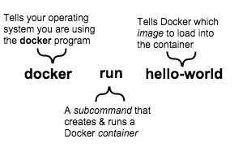

#####基本概念

* 镜像(Image)
    - 一个只读的模板,例如,一个镜像可以包含一个完整的Ubuntu系统环境,里面仅安装了Apache或其他用户需要的其他应用。镜像可以用来创建Docker容器
* 容器(Container)
    - Docker利用容器里创建和运行实例.它可以被启动、开始、停止、删除。每个容器都是相互隔离的。保证安全的平台。
    - 可以把容器看作是一个简易的Linux环境(包括root用户权限、进程空间、用户空间和网络空间等)和运行在其中的运用程序
    - 镜像是只读的，容器在启动的时候创建一层可写层作为最上层
* 仓库(Repository)
    - 仓库时集中存放镜像文件的场所。每个仓库包含了多D个镜像，每个镜像有不同的标签(tag)
    - 仓库分为公开仓库(public)和私有仓库(private)
    - 最大的公开仓库是[docker hub](hub.docker.com),存放了大量的镜像
    - 国内公开仓库包括"时速云"、"网易云"等，可以提供大陆用户更稳定快速的访问
    - 用户创建自己的镜像之后就可以使用push命令将它上传到共有或私有仓库,这样下次另一台主机要使用这个镜像的时候,只需要从仓库上pull下来就可以了。

接下来需要:

* 安装docker软件
* 在容器中运行一个软件镜像
* 在Docker Hub中查找镜像
* 创建一个自己的docker镜像
* 创建Docker Hub账户并建立镜像仓库
* 创建一个自己的镜像
* 将你的镜像push到你的Docker Hub

`docker run hello-world`详解:

当你运行`docker run hello-world`时,docker引擎会:

* 检查你是否有hello-world函数镜像
* 从docker hub下载镜像
* 在容器中加载镜像并运行它

Docker镜像可以像启动数据库一样复杂的启动软件,等你或其他人输入数据,存储数据。
