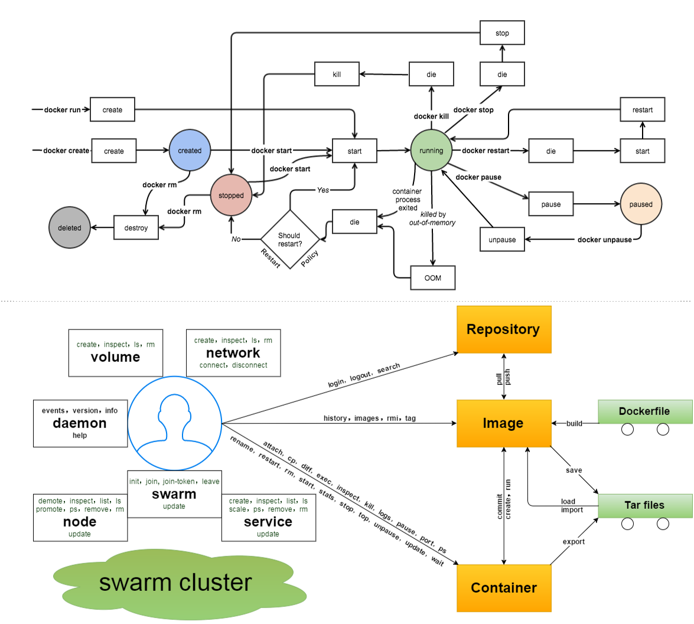

#####docker 使用方法:

Usage: docker [选项] 命令 [arg...]
       docker [ --help | -v | --version ]

* 选项:

```
    --config=""     指定客户端配置文件。默认为~/.docker
    -D=true|false   是否使用debug模式   --debug 
    -h              查看帮助            --help
    -v              查看版本信息并退出  --version
    -H              指定命令对应的docker daemon 的监听接口，可以为unix套接字(unit:///socket),文件句柄(fd://socketfd)或tcp套接字(tcp://[host]:[:port]),默认为unix:///var/run/docker.sock;
    -l="debug|info|warn|error|fatal"      指定日志输出级别  --log-level
    --tls=true|false   是否对docker daemon启用TLS安全机制,默认为false
```

* 命令:
```
    attach:     连接到一个运行中的容器
    build:      通过Dockerfile创建一个镜像
    commit:     从一个容器的修改中创建一个新镜像
    cp:         在容器和本地宿主系统之间复制文件
    create:     创建一个新容器,但不运行它
    diff:       检查一个容器文件系统的更改
    events:     从服务端获取实时的时间
    exec        在一个运行中的容器中运行命令
    export:     到处容器内容为一个tar包
    history:    显示一个镜像的历史信息
    images:     列出存在的镜像
    import:     导入一个文件(典型为tar包)路径或目录来创建一个本地镜像
    info:       显示一些相关的系统信息
    inspect:    显示一个容器的具体配置信息
    kill：      关闭一个运行中的容器(包括进程和所有相关资源)
    load:       从一个tar包中加载一个镜像
    login:      注册或登录到一个Docker的仓库服务器
    logout:     从Docker的仓库服务器登出;
    logs：      获取容器的log信息
    network:    管理docker的网络,包括查看、创建、删除、挂载、卸载等
    node:       管理swarm集群中的节点,包括查看、更新、删除、提升/取消管理节点等
    pause:      暂停一个容器的所有进程
    port:       查找一个nat到一个私有网口的公共扣
    ps:         列出主机上的所有容器
    pull:       从一个Docker的仓库服务器下拉一个镜像或仓库
    push:       将一个镜像或仓库推送到一个Docker的注册服务器
    rename:     重命名一个容器
    restart:    重启一个运行中的容器
    rm:         删除给定的若干个容器
    rmi:        删除给定的若干个镜像
    run:        创建一个新容器，并在其中运行给定命令
    save:       保存一个镜像为tar包文件
    search：    在Docker index 中搜索一个镜像
    service：   管理Docker所启动的应用服务,包括创建、更新、删除等
    start:      启动一个容器
    starts：    启动(一个或多个)容器的资源使用统计信息
    stop：      终止一个运行中的容器
    swarm：     管理Docker swarm 集群，包括创建、加入、退出、更新等
    tag:        为一个镜像打标签
    top:        查看一个容器中正在运行的进程信息
    unpause:    将一个容器中所有的进程从暂停中恢复
    version:    输出Docker的版本信息
    volume:     管理Docker volume,包括查看、创建、删除等
    wait:       阻塞知道一个容器终止,然后输出他的退出符

    docker [COMMAND] --help 查看docker命令的使用帮助
```





```
[root@hhf ~]# docker --help
Usage: docker [OPTIONS] COMMAND [arg...]
       docker [ --help | -v | --version ]

A self-sufficient runtime for containers.

Options:

  --config=~/.docker              Location of client config files
  -D, --debug                     Enable debug mode
  -H, --host=[]                   Daemon socket(s) to connect to
  -h, --help                      Print usage
  -l, --log-level=info            Set the logging level
  --tls                           Use TLS; implied by --tlsverify
  --tlscacert=~/.docker/ca.pem    Trust certs signed only by this CA
  --tlscert=~/.docker/cert.pem    Path to TLS certificate file
  --tlskey=~/.docker/key.pem      Path to TLS key file
  --tlsverify                     Use TLS and verify the remote
  -v, --version                   Print version information and quit

Commands:
    attach    Attach to a running container
    build     Build an image from a Dockerfile
    commit    Create a new image from a container's changes
    cp        Copy files/folders between a container and the local filesystem
    create    Create a new container
    diff      Inspect changes on a container's filesystem
    events    Get real time events from the server
    exec      Run a command in a running container
    export    Export a container's filesystem as a tar archive
    history   Show the history of an image
    images    List images
    import    Import the contents from a tarball to create a filesystem image
    info      Display system-wide information
    inspect   Return low-level information on a container, image or task
    kill      Kill one or more running containers
    load      Load an image from a tar archive or STDIN
    login     Log in to a Docker registry.
    logout    Log out from a Docker registry.
    logs      Fetch the logs of a container
    network   Manage Docker networks
    node      Manage Docker Swarm nodes
    pause     Pause all processes within one or more containers
    port      List port mappings or a specific mapping for the container
    ps        List containers
    pull      Pull an image or a repository from a registry
    push      Push an image or a repository to a registry
    rename    Rename a container
    restart   Restart a container
    rm        Remove one or more containers
    rmi       Remove one or more images
    run       Run a command in a new container
    save      Save one or more images to a tar archive (streamed to STDOUT by default)
    search    Search the Docker Hub for images
    service   Manage Docker services
    start     Start one or more stopped containers
    stats     Display a live stream of container(s) resource usage statistics
    stop      Stop one or more running containers
    swarm     Manage Docker Swarm
    tag       Tag an image into a repository
    top       Display the running processes of a container
    unpause   Unpause all processes within one or more containers
    update    Update configuration of one or more containers
    version   Show the Docker version information
    volume    Manage Docker volumes
    wait      Block until a container stops, then print its exit code

Run 'docker COMMAND --help' for more information on a command.
```


```
docker run --help

Usage:  docker run [OPTIONS] IMAGE [COMMAND] [ARG...]

Run a command in a new container

Options:
      --add-host value              Add a custom host-to-IP mapping (host:ip) (default [])
  -a, --attach value                Attach to STDIN, STDOUT or STDERR (default [])
      --blkio-weight value          Block IO (relative weight), between 10 and 1000
      --blkio-weight-device value   Block IO weight (relative device weight) (default [])
      --cap-add value               Add Linux capabilities (default [])
      --cap-drop value              Drop Linux capabilities (default [])
      --cgroup-parent string        Optional parent cgroup for the container
      --cidfile string              Write the container ID to the file
      --cpu-percent int             CPU percent (Windows only)
      --cpu-period int              Limit CPU CFS (Completely Fair Scheduler) period
      --cpu-quota int               Limit CPU CFS (Completely Fair Scheduler) quota
  -c, --cpu-shares int              设置 cpu 使用权重 (relative weight)
      --cpuset-cpus string          CPUs in which to allow execution (0-3, 0,1)
      --cpuset-mems string          MEMs in which to allow execution (0-3, 0,1)
  -d, --detach                      Run container in background and print container ID
      --detach-keys string          Override the key sequence for detaching a container
      --device value                Add a host device to the container (default [])
      --device-read-bps value       Limit read rate (bytes per second) from a device (default [])
      --device-read-iops value      Limit read rate (IO per second) from a device (default [])
      --device-write-bps value      Limit write rate (bytes per second) to a device (default [])
      --device-write-iops value     Limit write rate (IO per second) to a device (default [])
      --disable-content-trust       Skip image verification (default true)
      --dns value                   Set custom DNS servers (default [])
      --dns-opt value               Set DNS options (default [])
      --dns-search value            Set custom DNS search domains (default [])
      --entrypoint string           Overwrite the default ENTRYPOINT of the image
  -e, --env value                   Set environment variables (default [])
      --env-file value              Read in a file of environment variables (default [])
      --expose value                Expose a port or a range of ports (default [])
      --group-add value             Add additional groups to join (default [])
      --health-cmd string           Command to run to check health
      --health-interval duration    Time between running the check
      --health-retries int          Consecutive failures needed to report unhealthy
      --health-timeout duration     Maximum time to allow one check to run
      --help                        Print usage
  -h, --hostname string             Container host name
  -i, --interactive                 Keep STDIN open even if not attached
      --io-maxbandwidth string      Maximum IO bandwidth limit for the system drive (Windows only)
      --io-maxiops uint             Maximum IOps limit for the system drive (Windows only)
      --ip string                   Container IPv4 address (e.g. 172.30.100.104)
      --ip6 string                  Container IPv6 address (e.g. 2001:db8::33)
      --ipc string                  IPC namespace to use
      --isolation string            Container isolation technology
      --kernel-memory string        Kernel memory limit
  -l, --label value                 Set meta data on a container (default [])
      --label-file value            Read in a line delimited file of labels (default [])
      --link value                  Add link to another container (default [])
      --link-local-ip value         Container IPv4/IPv6 link-local addresses (default [])
      --log-driver string           Logging driver for the container
      --log-opt value               Log driver options (default [])
      --mac-address string          Container MAC address (e.g. 92:d0:c6:0a:29:33)
  -m, --memory string               Memory limit
      --memory-reservation string   Memory soft limit
      --memory-swap string          Swap limit equal to memory plus swap: '-1' to enable unlimited swap
      --memory-swappiness int       Tune container memory swappiness (0 to 100) (default -1)
      --name string                 Assign a name to the container
      --network string              Connect a container to a network (default "default")
      --network-alias value         Add network-scoped alias for the container (default [])
      --no-healthcheck              Disable any container-specified HEALTHCHECK
      --oom-kill-disable            Disable OOM Killer
      --oom-score-adj int           Tune host's OOM preferences (-1000 to 1000)
      --pid string                  PID namespace to use
      --pids-limit int              Tune container pids limit (set -1 for unlimited)
      --privileged                  Give extended privileges to this container
  -p, --publish value               Publish a container's port(s) to the host (default [])
  -P, --publish-all                 Publish all exposed ports to random ports
      --read-only                   Mount the container's root filesystem as read only
      --restart string              Restart policy to apply when a container exits (default "no")
      --rm                          Automatically remove the container when it exits
      --runtime string              Runtime to use for this container
      --security-opt value          Security Options (default [])
      --shm-size string             Size of /dev/shm, default value is 64MB
      --sig-proxy                   Proxy received signals to the process (default true)
      --stop-signal string          Signal to stop a container, SIGTERM by default (default "SIGTERM")
      --storage-opt value           Storage driver options for the container (default [])
      --sysctl value                Sysctl options (default map[])
      --tmpfs value                 Mount a tmpfs directory (default [])
  -t, --tty                         Allocate a pseudo-TTY
      --ulimit value                Ulimit options (default [])
  -u, --user string                 Username or UID (format: <name|uid>[:<group|gid>])
      --userns string               User namespace to use
      --uts string                  UTS namespace to use
  -v, --volume value                Bind mount a volume (default [])
      --volume-driver string        Optional volume driver for the container
      --volumes-from value          Mount volumes from the specified container(s) (default [])
  -w, --workdir string              Working directory inside the container

```


```
[root@hhf ~]# docker run --help

用法:  docker run [选项] 镜像 [命令] [ARG...]

在一个新容器中运行命令

选项:
      --add-host value              添加一个自定义的 主机-IP 映射 (host:ip) (default [])
      -a, --attach value                Attach to STDIN, STDOUT or STDERR (default [])
      --blkio-weight value          Block IO (relative weight), 10-1000之间
      --blkio-weight-device value   Block IO weight (relative device weight) (default [])
      --cap-add value               添加Linux功能 (default [])
      --cap-drop value              丢弃Linux功能 (default [])
      --cgroup-parent string        Optional parent cgroup for the container
      --cidfile string              将容器ID写入文件
      --cpu-percent int             CPU percent (Windows only)
      --cpu-period int              Limit CPU CFS (Completely Fair Scheduler) period
      --cpu-quota int               Limit CPU CFS (Completely Fair Scheduler) quota
  -c, --cpu-shares int              CPU shares (relative weight)
      --cpuset-cpus string          CPUs in which to allow execution (0-3, 0,1)
      --cpuset-mems string          MEMs in which to allow execution (0-3, 0,1)
  -d, --detach                      在后台运行容器并打印容器ID
      --detach-keys string          Override the key sequence for detaching a container
      --device value                Add a host device to the container (default [])
      --device-read-bps value       Limit read rate (bytes per second) from a device (default [])
      --device-read-iops value      Limit read rate (IO per second) from a device (default [])
      --device-write-bps value      Limit write rate (bytes per second) to a device (default [])
      --device-write-iops value     Limit write rate (IO per second) to a device (default [])
      --disable-content-trust       Skip image verification (default true)
      --dns value                   Set custom DNS servers (default [])
      --dns-opt value               Set DNS options (default [])
      --dns-search value            Set custom DNS search domains (default [])
      --entrypoint string           Overwrite the default ENTRYPOINT of the image
  -e, --env value                   设置环境变量 (default [])
      --env-file value              读入一个包含环境变量的文件 (default [])
      --expose value                Expose a port or a range of ports (default [])
      --group-add value             Add additional groups to join (default [])
      --health-cmd string           Command to run to check health
      --health-interval duration    Time between running the check
      --health-retries int          Consecutive failures needed to report unhealthy
      --health-timeout duration     Maximum time to allow one check to run
      --help                        打印帮助
  -h, --hostname string             容器的hostname
  -i, --interactive                 让容器的标准输入保持打开即使没有连接到容器
      --io-maxbandwidth string      Maximum IO bandwidth limit for the system drive (Windows only)
      --io-maxiops uint             Maximum IOps limit for the system drive (Windows only)
      --ip string                   容器的 IPv4 地址 (e.g. 172.30.100.104)
      --ip6 string                  容器的 IPv6 地址 (e.g. 2001:db8::33)
      --ipc string                  IPC namespace to use
      --isolation string            Container isolation technology
      --kernel-memory string        Kernel memory limit
  -l, --label value                 Set meta data on a container (default [])
      --label-file value            Read in a line delimited file of labels (default [])
      --link value                  添加到另一个容器的连接 (default [])
      --link-local-ip value         Container IPv4/IPv6 link-local addresses (default [])
      --log-driver string           Logging driver for the container
      --log-opt value               Log driver options (default [])
      --mac-address string          Container MAC address (e.g. 92:d0:c6:0a:29:33)
  -m, --memory string               限制内存
      --memory-reservation string   Memory soft limit
      --memory-swap string          Swap limit equal to memory plus swap: '-1' to enable unlimited swap
      --memory-swappiness int       Tune container memory swappiness (0 to 100) (default -1)
      --name string                 给容器分配一个容器名
      --network string              Connect a container to a network (default "default")
      --network-alias value         Add network-scoped alias for the container (default [])
      --no-healthcheck              Disable any container-specified HEALTHCHECK
      --oom-kill-disable            Disable OOM Killer
      --oom-score-adj int           Tune host's OOM preferences (-1000 to 1000)
      --pid string                  PID namespace to use
      --pids-limit int              Tune container pids limit (set -1 for unlimited)
      --privileged                  Give extended privileges to this container
  -p, --publish value               Publish a container's port(s) to the host (default [])
  -P, --publish-all                 Publish all exposed ports to random ports
      --read-only                   Mount the container's root filesystem as read only
      --restart string              Restart policy to apply when a container exits (default "no")
      --rm                          Automatically remove the container when it exits
      --runtime string              Runtime to use for this container
      --security-opt value          Security Options (default [])
      --shm-size string             Size of /dev/shm, default value is 64MB
      --sig-proxy                   Proxy received signals to the process (default true)
      --stop-signal string          Signal to stop a container, SIGTERM by default (default "SIGTERM")
      --storage-opt value           Storage driver options for the container (default [])
      --sysctl value                Sysctl options (default map[])
      --tmpfs value                 Mount a tmpfs directory (default [])
  -t, --tty                         分配一个伪终端
      --ulimit value                Ulimit options (default [])
  -u, --user string                 用户名或uid (格式: <name|uid>[:<group|gid>])
      --userns string               User namespace to use
      --uts string                  UTS namespace to use
  -v, --volume value                绑定挂载一个卷组 (default [])
      --volume-driver string        Optional volume driver for the container
      --volumes-from value          Mount volumes from the specified container(s) (default [])
  -w, --workdir string              Working directory inside the container
```