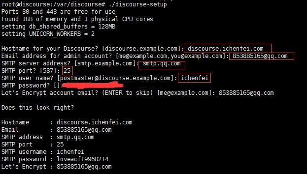

#####配置要求

* Linux服务器(内核版本>=3.1)
* 官方建议2G以上内存(可以使用虚拟内存)
* 基本的Linux命令行操作

#####安装docker

* 查看linux内核版本(官方建议内核版本大于3.1)

```
uname -r

4.4.0-38-generic
```

* 安装Docker(这里使用官方提供的脚本)
```
wget -qO- https://get.docker.io/ | sh
```

#####从github克隆discourse
```
sudo mkdir /var/discourse
sudo git clone https://github.com/discourse/discourse_docker.git /var/discourse
```

#####配置discourse

有两种方法:

* 手动配置
```
cd /var/discourse

cp samples/standalone.yml containers/app.yml

sudo vim containers/app.yml

修改下面字段的对应值:

  DISCOURSE_HOSTNAME: 'discourse.ichenfei.com'     ###配置域名,可用ip代替

  DISCOURSE_DEVELOPER_EMAILS: '853885165@qq.com'   ###开发者邮箱地址

  ## 配置SMTP邮箱
  DISCOURSE_SMTP_ADDRESS: smtp.qq.com         # 账号,必选
  DISCOURSE_SMTP_PORT: 25                          # 端口(可选, 默认 587)
  DISCOURSE_SMTP_USER_NAME: 853885165@qq.com       # 必选
  DISCOURSE_SMTP_PASSWORD: PASSSWORD               # 必选
  DISCOURSE_SMTP_ENABLE_START_TLS: false           # 加密(可选, 默认为true)


启动Discourse：

./launcher bootstrap app   #初始化

./launcher start app       #启动discourse容器
```


* 自动部署discourse:
```
sudo ./discourse-setup 
```


#####Diccourse维护

```
launcher 脚本:

launcher COMMAND CONFIG [--skip-prereqs] [--docker-args STRING]

COMMAND:
    start:      启动/初始化一个容器
    stop:       停止一个正在运行的容器
    restart:    重启一个容器
    destroy:    停止并删除一个容器
    enter:      使用 nsenter 进入容器
    logs:       容器的Docker日志
    bootstrap:  基于配置模版来引导一个容器
    rebuild:    重建一个容器（摧毁旧的,初始化,启动新的）
    cleanup:    清理所有停止了超过24小时的容器

Options:
    --skip-prereqs             不检查前置需求
    --docker-args              当运行 docker 时，展开并传入参数
    --skip-mac-address         不分配mac地址

```
