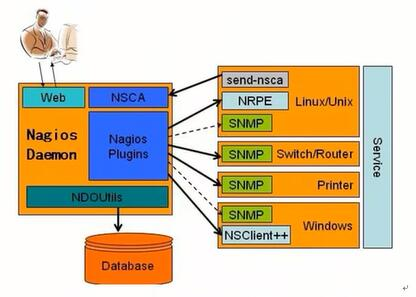

>Nagios是一款开源的网络及服务的监控工具，其功能强大,灵活性强。能有效监控Windows，Linux,Unix等系统的主机各种状态信息，交换机，路由器等网络设备，主机端口及URL服务等。

* 官方网站:[www.nagios.org](https://www.nagios.org/)
* 快速安装说明:[快速安装说明](https://assets.nagios.com/downloads/nagioscore/docs/nagioscore/3/en/quickstart-fedora.html)

#####Nagios特点:

* 监控网络服务(SMTP,POOP3,HTTP,TCP,PING等)
* 监控主机资源(CPU,负载,IO状态,虚拟及正式内存及磁盘利用率等)
* 简单地插件设计模式使得用户可以方便定制符合自己的服务的监测方法
* 并行服务检查机制
* 具备定义网络分层结构的能力,用"parent"主机定义来表达网络主机间的关系,这种关系可被用于发现和明晰主机宕机或不可达状态
* 当服务或主机问题产生与解决后将报警发送给联系人(mail/im/sound语音)
* 具备定义事件句柄功能，它可以在主机或服务的时间发生时获取更多问题定位
* 自动的日志回滚
* 可以支持并实现对主机的冗余监控(支持分布式监控)
* 可选的WEB界面用于查看当前的网络状态,通知和故障历史，日志文件等

Nagios监控系统家族成员的构成:

Nagios监控一般由一个主程序(nagios),一个插件程序(nagios-plugins)和一些附加的程序(NRPE,NSClient++,NSCA和NDOUtilsd等)。

Nagios本身只是一个监考平台，其具体的监控工作都是通过插件实现的，因此Nagios主程序和Nagios-plugin插件都是Nagios服务端。必须要安装的程序组件,Nagios-plugins一般也要用于安装于被监控端。几个附加程序描述如下。

* NRPE:`半被动模式`
    - `存在位置`: NRPE软件工作于被监控端，操作系统为Linux,UNIX系统
    - `作用`: 用于在被监控的远程Linux/UNIX主机上执行脚本插件获取数据回传给服务器端，以实现对这些主机资源的监控
    - `存在形式`: 守护进程(agent)模式,开启的端口为 5666
    - `本地资源`: 负载(uptime),CPU(TOP,sar),内存(free,swap),IO(iostat),RAID级别，CPU温度，passwd文件变化,本地所有文件自问识别监控。

* *NSClient++: 半被动模式
    - `存在位置`:用于被监控端为Windows系统的服务器
    - `作用`： 功能相当于Linux系统的NRPE
    - 用于监控Windows主机时,安装在Windows主机上的组件

* *NDOUtils(不推荐用)
    - 存在位置: nagios 服务器端
    - 作用: 用于将Nagios的配置信息和各enent产生的数据存入数据库以实现对这些数据的检索和处理

* NSCA(纯被动模式的监控)
    - 位置: 需要同时安装在 nagios 服务器端课客户端
    - 作用: 用于让被监控的远程 Linux/UNIX 主机主动将监控到的信息发送给 Nagios 服务器端
    - 分布式监控要用到,300台服务器以内，可以不用
    - [
    Nagios Core Manuals](http://library.nagios.com/library/products/nagioscore/manuals/)

#####Nagios 原理

1.NRPE运行原理图:

2.NSClient++原理图:

3.NDOUtils原理图:

4.NSCA运行原理图:

5.Nagios监控工具综合系统简单原理图

