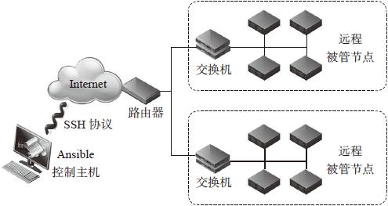

#####开源自动化配置工具

开源自动化配置工具|watch| star |fork|开始时间 |贡献者 
------------------|-----|------|----|---------|------
ansible/ansible   |1456 |18607 |5633|2012-2-5 |1467 
puppetlabs/puppet |473  |4139  |1703|2005-4-10|430    
saltstack/salt    |530  |6840  |3105|2011-2-20|1194  
Chef/chef         |393  |4408  |1845|2008-5-2 |468   
CFEngine/core     |     |      |    |2007-12-30|      

#####ansible系统架构

>Ansible集合了众多运维工具(puttle,Cfrngine,Func,Fabric)的优点实现可批量系统配置，批量程序部署，批量运行命令的功能。Ansible是基于模块工作的，本身没有批量部署的功能。真正具有部署功能的是Ansible所运行模块

ansible系统架构:

* 核心引擎:ansible
* 核心模块(core moudles):这些都是ansible自带的模块，ansible模块分发到远程节点使其执行特定任务或匹配一个特定的状态
* 自定义模块(custom modules):如果核心模块不足以完成某些功能，可以添加自定义模块
* 插件(plugins):完成模块功能的补充，借助于插件完成记录日志，邮件的功能。
* 剧本(playbook):定义ansible任务的配置文件，可以将多个任务定义在一个剧本中，由ansible自动执行，剧本执行支持多个任务，可以控制主机运行多个任务，同时对多台远程主机进行管理
* 连接插件(connectior plugins):ansible基于连接插件连接到各个主机上，负责和被管节点实现通信。虽然ansible使用ssh连接到被管节点，但它还是支持其他连接方法，所以需要有连接插件
* 主机清单(host inventory):定义ansible管理的主机策略，默认是ansible配置文件中定义被管节点，同时也支持定义动态主机和指定配置文件的位置。

>Ansible采用paramiko协议库(Fabric也使用这个)，通过ssh或者zeroMQ等连接主机。Ansible在控制主机将Ansible模块通过SSH协议推送到被管节点执行，执行完之后自动删除，可以使用svn等来控制自定义模块及编排。控制主机和被管节点之间支持local,ssh,zeroMQ三种连接方式，默认使用基于SSH的连接。在规模较大的情况下使用ZeroMQ连接方式会明显改善执行精度

Ansible playbook分享平台:[galaxy.ansible.com](https://galaxy.ansible.com/)。

在galaxy分享平台找到代码后可运行`ansible-galaxy install+作者id.角色名称`就可以安装到本地。

#####Ansible功能特性:

* Ansible可以实现以下目标
    - 应用代码自动化部署
    - 系统管理配置自动化
    - 支持持续交付自动化
    - 支持云计算,大数据平台
    - 轻量级，无需再客户端安装agent，更新时只需在控制机上进行一次更细即可
    - 批量任务执行写成脚本，不必分发 到远程就可执行   
    - 使用Python编写，维护更简单
    - 支持非root用户管理操作,支持sudo
* 语法简单、易读
    - playbook语法基于YAML，具有可读性好、交互性强、表达能力强、扩展性好等特点
* 不需要在被管节点安装客户端软件
* 基于推送(Push)方式(管理过程如下)
    - 1、增加或修改playbook
    - 2、执行新的playbook
    - 3、控制节点的Ansible连接被管节点并执行修改被管节点状态的模块
    - 一旦执行ansible-playbook命令Ansible就会连接到远程的被管节点并按照脚本要求执行
* 方便管理小规模场景
* 大量内置模块
    - Ansible内置模块都是等幂性的(idenmportent)。等幂性对于自动化运维非常重要，这样在被管节点多次执行Ansible的playbook也能达到同样效果。相对于对执行操作系统脚本的方式是巨大的改进，操作系统脚本可再执行一次可能产生不同的非预期的效果
    - 等幂性eg： user=deploy group=web 如果系统中没有用户deploy，则Ansible会创建一个deploy账号，如果这个账号已经存在,则Ansible什么都不会做
* 非常轻量的抽象层

#####Ansible与DevOps(Development and Operations)

>Devops是一组方程、方法与系统的统称，用于促进软件开发(应用程序/软件工程)，技术运营和质量保障(QA)部门之间的沟通，协调与整合。