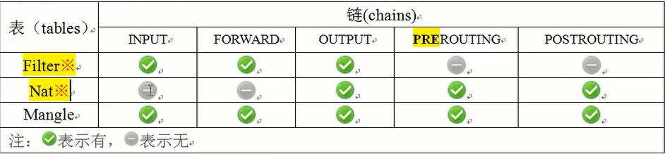
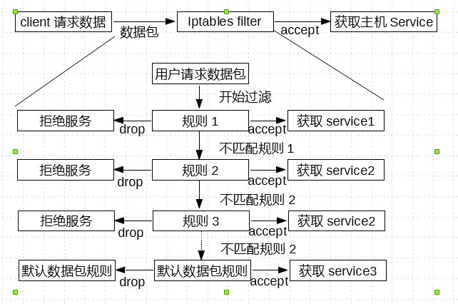
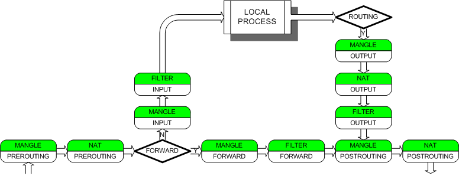

####iptables防火墙简介
>iptables是unix/linux自带的一款优秀且开源的`基于包过滤的防火墙`工具，它的功能十分强大，使用十分灵活，可以对流入和流出服务器的数据包进行很精细的控制。

>iptables是linux 2.4及2.6内核中集成的服务。期功能比安全性比老一辈的ipfwadm,ipchains强大很多。主要工作在OSI七层协议的二、三、四层，如果重新编译内核，iptables也可以支持7层控制(squid 代理+iptables)

####iptables名词和术语

* 容器: 用来描述包含或者属于的关系
* Netfilter/iptables: Netfilter是表(tables)的容器
* 规则:iptables 一些列过滤信息的规范和具体方法
* 链: 链(chains)是规则(policys)的容器.
    - INPUT
    - OUTPUT
    - FORWARD
    - PREROUTING ----进来之前路由(预路由)
    - POSTROUTING ----出去时路由
* 表: 表(tables)是链(chains)的容器,即所有的链(chains)都属于其对应的表(tables)。
    * filter表
    * nat表
    * mangle表 -----用的比较少
    * raw表 -----这张表很少用

####filter表
>主要和主机自身有关真正负责防火墙功能的(过滤流入流出主机的数据包)。filter表时iptables默认使用的表。这个表定义了三个链(chain):

* **INPUT**:

> 负责过滤所有目标地址是本机地址的数据包。通俗的说,就是过滤进入主机的数据包
 
* FORWARD:

>负责转发流经主机的数据包。起转发的作用，和Nat关系很大。LVS NAT模式。net.ipv4.ip_forward=0

* OUTPUT:

>处理所有源地址是本机地址的数据包，通俗的讲，就是处理从主机发出去的数据包

**对于filter表的控制是实现本机防火墙功能的重要手段，特别是对INPUT链的控制**

####nat表

>主要负责网络地址转换，即 **来源与目的ip地址和port的转换** 
>应用:一般与局域网共享上网或者特殊端口转换服务相关

应用场景:

1. 用于做企业路由(zebra)或网关(iptables),共享上网(POSTROUTING)
2. 做内部IP地址一对一映射(dmz)，硬件防火墙映射IP到内部服务器,ftp服务。(PREROUTING)
3. web，单个端口的映射，直接映射80端口(PREROUTING)

>这个表定义了三个链(chains)，nat功能就相当于网络的acl控制，和网络交换机acl类似

* OUTPUT: 

>和主机发出去了的数据包有关。改变主机发出数据包的目的地址

* PREROUTING

>在数据包到达防火墙时进行路由判断之前执行的规则，作用是改变数据包的目的地址，目的端口等(比如可以吧公网ip:115.159.159.217映射到局域网10.0.0.19服务器上，或者把80赚为局域网服务器上的9000端口)

* POSTROUTING

>在数据包离开防火墙时进行路由判读之后执行的规则，作用改变数据包的`源地址`、`源端口`等(比如笔记本和虚拟机都是10.0.0.0/25,就是出网时候被路由器把源地址改成公网地址了)
>生产应用:局域网共享上网

#####mangle表
>主要负责修改数据包中特殊的路由标记,如TTL,TOS,MARK等。

####iptable工作流程

>iptables是采用数据包过滤机制工作的，所以它会对请求的数据包的包头数据进行分析，并根据我们预先设定的规则进行匹配来决定是否可以进入主机。

>数据包的流向是从左向右的。

* 小结
    - 防火墙时层层过滤的，实际是按照配置规则的顺序从上到下，从前到后进行过滤的
    - 如果匹配上规则，即明确表明是阻止还是通过，数据包就不在向下匹配新规则了。
    - 如果规则上没有明确表示阻止还是通过，也就是没有匹配规则，向下进行匹配，知道匹配默认规则得到明确是阻止还是通过
    - 放个墙默认规则是所有的规则执行完后才执行的

####iptables表和链的工作流程图  

下面这张图描绘了netfilter对包的处理流程:

