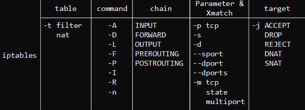

#####iptables：

    -h 查看帮助 --help
    -V 查看版本 --version
    -n 地址和端口的数字输出
    -L 列表查看规则
        iptables -L -n 查看iptables规则
    -F 删除所有规则，但不会删除默认规则 --flush
    -X 删除用户自定义的链 --delete-chain
    -Z 对链的计数器清零 --zero

    -t 指定表,不加的话默认为filter表 --table eg: -t filter
    -A 添加规则到指定链的最后一条
    -I 添加规则到指定链的第一条 
    -D 删除规则
    -p 指定协议 --proto  (tcp,udp,icmp)
    -i 指定接收数据包的网卡 --in-interface  (-i eth0)
    -o 指定发送数据包的网卡  --out-interface
    -j 指定行为 --jump (ACCEPT(接受) DROP(丢弃) REJECT(拒绝))
    -s 指定来源地址 --source
    -d 指定目标地址  --destination
    -m 匹配 --match
    -P 设置某条规则链的默认动作  --policy  (eg: iptables -P INPUT  DROP )
    --dport 指定目的端口 --destination-port
    --sport 指定源端口   --source-port
    --line-numbers 给规则加上序号


#####禁止规则:

基本的处理行为：ACCEPT(接受) DROP(丢弃) REJECT(拒绝)

示例:
```
iptables -t filter -A INPUT -p tcp --dport 22 -j DROP  禁止22端口
等价于
iptables -A INPUT -p tcp --dport 22 -j DROP   
```
恢复刚才断掉的ssh连接:

* 去机房重启系统或者登陆服务器删除刚刚的禁止规则
```
iptables -t filter -D INPUT -p tcp --dport 22 -j DROP  禁止22端口
```
* 让机房人员冲去服务器或让机房人员拿用户密码登陆进去
* 通过服务器的远程管理卡管理(推荐)
* 先写一个定时任务，没5分钟就停止防火墙
* 测试环境测试号，写成脚本批量执行

添加规则:
```
iptables -t filter -A INPUT -p tcp --dport 80 -j DROP 
或者
iptables -t filter -I INPUT -p tcp --dport 80 -j DROP 
INPUT 后面加数字能指定插入的序号:
iptables -t filter -I INPUT 2 -p tcp --dport 80 -j DROP 
```
删除规则续小结:
```
iptables -F 删除所有规则
iptables -t filter -D INPUT -p tcp --dport 80 -j DROP
或者
iptables -L -n --line-numbers
iptables -t filter -D 序号
/etc/init.d/iptables restart (用iptables命令行配置的命令都是零时生效的)
```

应用(封ip):
```
awk '{print $1}' /var/log/nginx/access.log|sort|uniq -c|sort -rn -k1
   1702 49.223.186.170
    798 101.226.35.225
    660 160.16.101.244
    501 122.9.2.98
    265 107.167.178.116

iptables -t filter -I INPUT  -p tcp -s 49.223.186.170 --dport 80 -j DROP

```


**参考:**

[iptables防火墙原理详解](https://segmentfault.com/a/1190000002540601)





####练习:
```
iptables -t filter -I INPUT -i eth0 -s 192.168.58.0/24 -j DROP eth0封掉整个网段

iptables -t filter -I INPUT -i eth0 ! -s 192.168.58.1 -j DROP 除了192.168.58.1全封掉
iptables -t filter -I INPUT -p icmp -j DROP  禁ping


匹配端口范围:
iptables -A INPUT -p tcp --dport 3306:8809 -j ACCEPT  接受3306-8809端口
iptables -A INPUT -p tcp -m multiport --dport 21,22,23,24,25 -j ACCEPT 接受21,22,23,24,25端口

匹配网络端口:
iptables -A INPUT -i eth0   --in-interface
iptables -A FORWARD -o eth0 --out-interface

匹配网络状态(ftp常用):
-m --state state
  NEW:已经或将启动新的连接
  ESTABLISHED:已经建立的连接
  RELATED:正在启动新连接
  INVALID:非法或无法识别的连接
```

####企业防火墙配置:
```
iptables -F
iptables -X
iptables -Z    ### 先清除所有防火墙配置，计数器清零

iptables -A INPUT -i lo -j ACCEPT    ### 允许本机进
iptables -A OUTPUT -o lo -j ACCEPT   ### 允许本机出

iptables -P INPUT  DROP  
iptables -P OUTPUT  ACCEPT 
iptables -P FORWARD  DROP   # 设置默认规则drop

iptables -A INPUT -p all -s 192.168.58.0/24 -j ACCEPT  
iptables -A INPUT -p all -s 10.0.0.0/24 -j ACCEPT  
。。。
####允许合法的网段ip进入
iptables -A INPUT -p tcp -s 10.0.0.0/24 --dport 80 -j ACCEPT  ##打开80端口

iptables -A INPUT -p icmp --icmp-type 8 -j ACCEPT    ##允许ping

##允许关联的状态包(ftp服务会用)
iptables -A INPUT -m state --state  ESTABLISHED,RELATED -j ACCEPT
iptables -A OUTPUT -m state --state  ESTABLISHED,RELATED -j ACCEPT

```


Netfilter/iptables 所设置的规则是存放在内核内存中的，重启会失效，如果想要永久生效，使用:
```
/etc/init.d/iptables save
iptables: Saving firewall rules to /etc/sysconfig/iptables:[  OK  ]
或者使用
iptables-save >  /etc/sysconfig/iptables  (第一次重定向，后面用追加)
```


* 服务器网关需具备如下条件
    * 物理条件是具备双网卡，建议eth0外网地址，eth1内网地址
    * 确保服务器网关B可以上网(B上网才能代理别的机器上网)。可以通过ping baidu.com测试
    * 内核文件/etc/syscul.conf里开启转发功能。    
        * 编辑 /etc/sysctl.conf,修改内容net.ipv4.ip_forward = 1，然后执行sysctl -p使修改生效。

局域网共享有两条命令:
```
1.iptables -t nat -A POSTROUTING -s 10.0.0.0/24 -o ehh0 -j SNAT --to-source 192.168.58.136
```
* -s 10.0.0.0 办公室或IDC内网网段
* -o eth0 为网关的外网卡接口
* -j SNAT --to-source 是网关外网卡IP地址
```
2.伪装
iptables -t nat -A POSTROUTING -s 10.0.0.0/24 -j MASQUERADE 
```

```
iptables -t nat -A PREROUTING -d 10.0.0.7 -p tcp --dport 80 -j DNAT --to-destination 191.168.1.8:9000 
端口转发
```

```
iptables --help

Usage: iptables -[ACD] chain rule-specification [options]
       iptables -I chain [rulenum] rule-specification [options]
       iptables -R chain rulenum rule-specification [options]
       iptables -D chain rulenum [options]
       iptables -[LS] [chain [rulenum]] [options]
       iptables -[FZ] [chain] [options]
       iptables -[NX] chain
       iptables -E old-chain-name new-chain-name
       iptables -P chain target [options]
       iptables -h (print this help information)

Commands:
Either long or short options are allowed.
  --append  -A chain        Append to chain
  --check   -C chain        Check for the existence of a rule
  --delete  -D chain        Delete matching rule from chain
  --delete  -D chain rulenum
                Delete rule rulenum (1 = first) from chain
  --insert  -I chain [rulenum]
                Insert in chain as rulenum (default 1=first)
  --replace -R chain rulenum
                Replace rule rulenum (1 = first) in chain
  --list    -L [chain [rulenum]]
                List the rules in a chain or all chains
  --list-rules -S [chain [rulenum]]
                Print the rules in a chain or all chains
  --flush   -F [chain]      Delete all rules in  chain or all chains
  --zero    -Z [chain [rulenum]]
                Zero counters in chain or all chains
  --new     -N chain        Create a new user-defined chain
  --delete-chain
            -X [chain]      Delete a user-defined chain
  --policy  -P chain target
                Change policy on chain to target
  --rename-chain
            -E old-chain new-chain
                Change chain name, (moving any references)
Options:
[!] --proto -p proto    protocol: by number or name, eg. `tcp'
[!] --source    -s address[/mask][...]
                source specification
[!] --destination -d address[/mask][...]
                destination specification
[!] --in-interface -i input name[+]
                network interface name ([+] for wildcard)
 --jump -j target
                target for rule (may load target extension)
  --goto      -g chain
                              jump to chain with no return
  --match   -m match
                extended match (may load extension)
  --numeric -n      numeric output of addresses and ports
[!] --out-interface -o output name[+]
                network interface name ([+] for wildcard)
  --table   -t table    table to manipulate (default: `filter')
  --verbose -v      verbose mode
  --line-numbers        print line numbers when listing
  --exact   -x      expand numbers (display exact values)
[!] --fragment  -f      match second or further fragments only
  --modprobe=<command>      try to insert modules using this command
  --set-counters PKTS BYTES set the counter during insert/append
[!] --version   -V      print package version.
```
